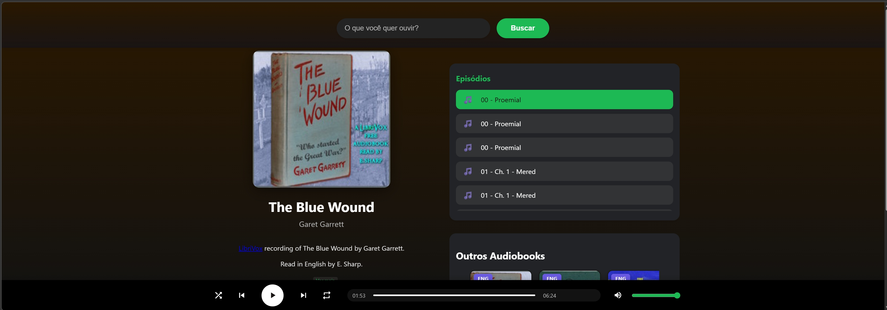

# 🎧 AudioBook Interativo

> Player de audiobooks gratuito com busca em tempo real, integrado à biblioteca do [LibriVox](https://librivox.org/) via API do [Internet Archive](https://archive.org/).

---

## 📸 Screenshots

> O projeto está em ajuste no frontend.



---

## ✨ Funcionalidades

- 🔍 **Busca** de audiobooks por título na acervo do LibriVox
- 🖼️ **Capas** carregadas dinamicamente via Archive.org
- 📋 **Lista de episódios** com seleção individual de faixa
- ▶️ **Player completo** com play, pause, próximo, anterior, repetir e embaralhar
- ⏱️ **Barra de progresso** com fill dinâmico e seek por clique/arraste
- 🔊 **Controle de volume** persistido no localStorage
- 💾 **Posição salva** retoma de onde parou ao reabrir
- 🃏 **Carrossel de audiobooks** com botões anterior/próximo
- 📖 **Modal de descrição completa** com backdrop blur
- 📱 **Layout responsivo** para mobile e tablet

---

## 🚀 Como rodar

O projeto é **100% frontend** — sem build, sem dependências, sem servidor.

```text
# Clone o repositório
git clone https://github.com/MaxsuelOliveira/web-audiobook-interativo.git

# Abra o index.html diretamente no navegador
# OU use o Live Server do VS Code
```

> **Atenção:** como usa ES Modules (`type="module"`), é necessário servir via HTTP (Live Server, http-server, etc.). Não funciona com `file://` direto no navegador.

---

## 🗂️ Estrutura

```
web-audiobook-interativo/
├── index.html          # Estrutura principal da aplicação
├── styles/
│   └── app.css         # Estilos completos (variáveis, layout, responsivo)
└── js/
    ├── api.js          # Integração com a API do Archive.org / LibriVox
    └── main.js         # Lógica do player, renderização e eventos
```

---

## 🌐 APIs utilizadas

| Endpoint                                  | Uso                                           |
| :---------------------------------------- | :-------------------------------------------- |
| `archive.org/advancedsearch.php`          | Busca de audiobooks na coleção LibriVox       |
| `archive.org/metadata/{id}`               | Metadados, episódios e capa de cada audiobook |
| `archive.org/services/img/{id}`           | Imagem de capa do audiobook                   |
| `archive.org/download/{id}/{arquivo}.mp3` | Stream dos episódios de áudio                 |

---

## 🛠️ Tecnologias

- **HTML5** — `<audio>`, `<dialog>`, ES Modules
- **CSS3** — Custom Properties, Flexbox, Scroll Snap, `backdrop-filter`
- **JavaScript** — Vanilla JS, `async/await`, `localStorage`

---

## 📄 Licença

Os audiobooks são disponibilizados pelo [LibriVox](https://librivox.org/) sob domínio público.  
O código deste projeto está sob a licença [MIT](./LICENSE).
